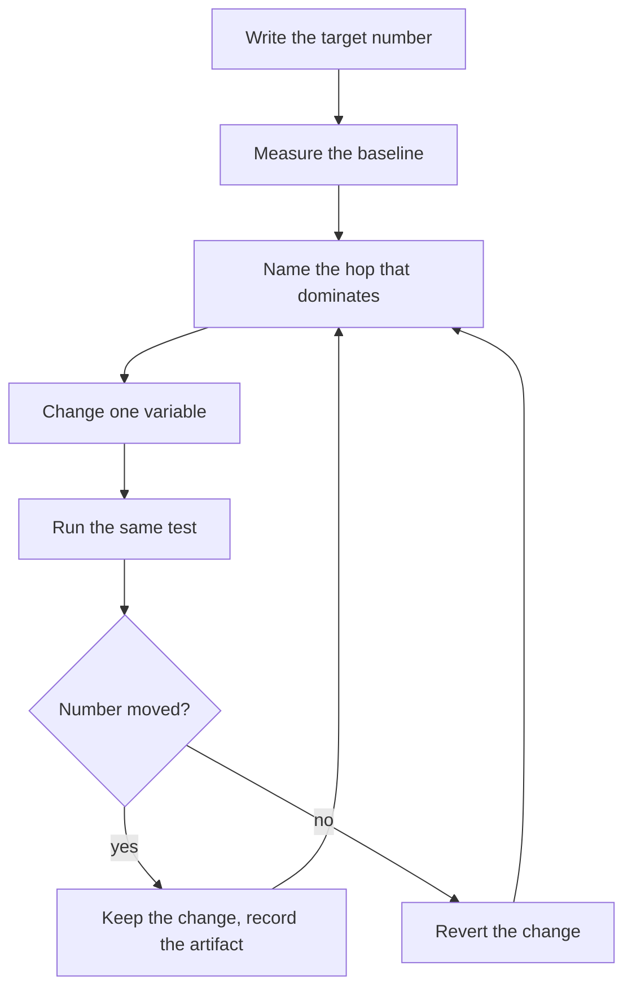

# Load-Test-Driven Development: Write the Number Before the Code

*Treat a throughput target like a failing test, and let the data decide every change.*

Test-driven development has a simple loop. Write a test that fails. Change the code until it passes. Keep the change.

I use the same loop for scale. The test is a number: messages per second, a latency percentile, a backlog that must not grow. The number comes first, before any design or tuning. Then every change must move that number, or it goes back out.

I learned this on two platforms. At my current job I work on a notification engine that handles peaks of 1.5 million messages per minute. I also built and load tested a message pipeline of the outbox shape, which I wrote about in [Build a Message Pipeline That Never Drops a Message](/blog/outbox-postgres-redis/). That post covers what I changed. This post covers how I decided what to change, and the many times the data told me I was wrong.

## Part 1: the loop

A load test is not a demo you run at the end. It is the test suite for a scaling project. It needs the same discipline as a unit test suite.



Four rules make the loop work.

**Write the pass bar before the run.** My bar for one traffic shape was: the accepted rate reaches 95% of the target, the backlog does not grow over the final two thirds of the window, and no more than 1% of messages are left without an outcome after the drain. If you write the bar after the run, you will write it to match the result.

**Change one variable per run.** I call each run a rung on a ladder. A rung that passes keeps its change. A rung that fails reverts it. Two changes in one rung give you one number and two unknowns.

**Stop climbing when climbing stops paying.** If you grow a component twice and the number does not move, stop. The limit is then a serial step or a schema cost, not the instance count. On my pipeline the limit came from single-row write convoys. No number of instances could fix those.

**Grow the database last, and only upward.** Many managed databases cannot shrink after a resize. So I tuned the applications first, against a full-size database, so that a starved database could not look like an application limit. Then I sized the database from the smallest credible plan upward.

## Part 2: data before theories

The worst night of the project started with a campaign that slowed from a normal rate to a small fraction of it. Everybody had a theory. Queue memory. Unstable carrier connections. The protocol window. The database.

We tested eight theories that night, and the data disproved all eight.

One number broke the case. The span for the carrier submit call got **faster** as throughput fell. Submits did not slow down. They stopped happening. So the carrier, the connections, and the protocol window were all innocent. The fault sat in front of the submit call.

It was an HTTP client in the gateway service. That service looked up a route that the upstream worker had already sent to it, with three outbound calls per message. The client ran out of connections, and the event loop starved. The proof was simple: a read-only status endpoint that does no outbound work timed out during the jam, and answered fast again ninety seconds after the queue drained.

The lesson is not about HTTP clients. It is about order. Read the numbers that exist before you add a new theory. Every theory costs a run. A number you already have costs nothing.

### A formula tells you the size of the wall, not its name

For a worker pool, one formula predicts sustained throughput:

```
sustained rate = concurrent send slots / seconds per message
```

Both terms are easy to read from a running system. On my pipeline the formula predicted the measured rate within 6% on three separate runs.

But it did not tell me which component was the denominator. Two of those runs were bound by the database. The third was bound by the CPU of a single process in a different service. Two walls stood at almost the same height, one behind the other.

That is why the HTTP fix above was a large fix that did not raise the ceiling. It removed the first wall and exposed the second wall at the same rate.

Never report a rate without the name of the hop that takes most of each message's time. Instrument every hop, and find the one that is most of the total.

### Test the theory, then test the fix

Later I had a strong theory about that single process. A profile showed a blocking cache write that took 45% of the event loop's time. The fix was obvious: remove the write.

I ran an A/B test instead of trusting the profile. Removing 45% of the loop's work had no effect on throughput. A different change, less logging per message, gave 15%.

That result proved the event loop was not the limit, and it pointed at the real cost: the work done per message inside one process. A profile tells you where time goes. Only a before and after run tells you whether that time is the limit.

## Part 3: the instrument lies

A load test is a measurement instrument. Instruments have bugs. Most of my wrong conclusions came from the instrument, not from the system.

**The table you count may be empty.** An earlier change moved per-message events from a separate table into a column on the message row. The old measurement script still counted the old table. It reported 0.0 messages per second on a healthy system that delivered normally.

**The window shape changes the answer.** I tried two measurement windows and both gave confident, wrong numbers:

- A fixed 60-second warm-up trim removed every event from a short smoke test, and read zero.
- A window from the first accepted event to the last one read less than half the true rate. A few slow stragglers stretched the end of the window far past the real work.

The window that works is the 10th to the 90th percentile of the accepted timestamps. By construction it holds 80% of the events. It trims the start and the tail equally, and a two-second smoke test and a thirty-minute soak both measure correctly with no tuning.

**Check every headline against its own profile.** Bucket the events into 10-second intervals and look at the shape. If one summary number disagrees with its own profile, the number is a metric bug, not a platform result. That single check caught both window defects.

**Divide by real timestamps, not by loop labels.** One sampler loop ran 11.7% slow. It produced a false headline that hit the target exactly.

**Read interval means, not lifetime means.** A metrics endpoint that reports the average since process start hides the present. One bad hour poisons it for the rest of the day. At one point the lifetime mean for the slowest hop was about 40% higher than the live interval mean, which was falling. Sample twice and compute the mean for the interval between the samples.

**Never compare a peak with an average.** Two runs looked like a large regression. They were not. Both peaked at about the same rate. One report quoted the peak and the other quoted the average. In one run, fewer than 2% of the seconds came anywhere near the peak. A per-second peak is the tail of one distribution, not a normal rate.

## Part 4: the test must look like production

A load test that passes against the wrong traffic proves nothing. Two mistakes cost me the most time.

### A rate cap measures the cap

My pipeline lets a tenant cap the campaign rate. The dispatcher sends a chunk, then sleeps. I used that cap on sizing runs, to ask "can this fleet do the target rate?"

That was the wrong question to ask with a cap. These numbers come from one fleet on a throwaway test rig:

| Run | Measured rate |
|---|---:|
| Uncapped | 942 per second |
| Cap 1,000 | 633 per second |
| Cap 400 | 320 per second |

A cap of 1,000 cannot pull a fleet below 942. It did. The sleep gaps between chunks fell inside the measurement window. The cap could only hold the fleet down, so every capped run measured the cap and its sleep pattern, not the fleet.

A ladder driven that way would have sized the whole platform against a number the instrument invented.

Run sizing rungs uncapped, with a fixed message count, and ask directly: does the fleet reach the target? Use caps only on soak tests, where the question is stability at a known rate.

### Synthetic data hides real bugs

My load generator made recipient numbers that shared a small set of prefixes. A cache keyed on the prefix looked perfect under that data. The miss rate was 0.24%.

On a real campaign, the same code missed 8.2% of the time. That gap hid a bug for weeks, because every load test said the cache was fine.

Build test data from the shape of real data: the real spread of keys, the real payload sizes, the real mix of message types. And keep separate numbers for separate traffic shapes. A result from many small broadcasts does not answer a question about one large campaign file. I state the traffic shape next to every rate in every report.

### Include the return traffic

Messages cause return traffic: delivery receipts, status callbacks, webhooks. A test that sends and ignores the return leg measures a system that does not exist.

On one day of real campaigns, the only campaign whose receipts flowed during the send ran about 22% slower than the others. Same tenant, same route, same sender. It is one sample, so I treat it as a strong lead, not a constant. But it is the normal case in production, so it is the number I use for safety calculations.

## Part 5: keep the experiment clean

Small process errors make a load test lie as badly as a metric bug.

**Compare only on the same instance, in the same session.** I measured the same INSERT on two instances of the same plan and got times more than two times apart. Instance variance was larger than most of the effects I was trying to measure.

**Use a unique run ID for every run.** My API deduplicates requests. A reused campaign label returned success and delivered nothing, which looks exactly like a throughput ceiling.

**Reset state between rungs, and prove the reset.** Truncate the tables, flush the queue store, reset the query statistics, and then assert that the counts are zero. One missing table can make a truncate fail as a whole, with no loud error.

**Start every sampler on every run.** One run had a sampler that did not start, and a 17% step in the rate stayed unexplained forever.

**Do not let the sampler load the system.** One sampler ran `count(*)` on a large message table. It took about 5% of all database time.

**Never profile an idle service.** An idle profile missed the largest cost in the event loop entirely. Profile under the load you want to fix.

**Every number traces to a raw file.** If the artifact for a rung is missing, run the rung again. Do not explain the gap from memory. An estimate that looks like a measurement is worse than a gap.

## Part 6: the load test belongs in the design phase

Everything above is about tuning a system that exists. The larger gain comes earlier.

At my current job I designed real-time analytics on PostgreSQL with time-based partitions managed by `pg_partman`. Before we committed to that design, we benchmarked it at production scale, across more than 18 billion conversations per quarter. The benchmark was the acceptance test for the design, not a check at the end.

The same idea applies to observability. When I added metrics, dashboards, and alerts across our platform, mean time to detect and mean time to resolve fell by 90%. A load test can only tell you what your instruments can see. If a hop has no timer, that hop can hide a wall. So I add the per-hop timers, the pool wait metrics, and the backlog depth before the first load test, not after the first surprise.

And some limits only show up in a test that runs long enough. A queue store with a fixed memory limit and a no-eviction policy does not slow down when it fills. It refuses writes, and messages strand in silence. If ingest runs faster than the drain, the difference collects in the store until it breaks. The rule that came from that test is simple: set the ingest cap at or below the measured drain rate. You find the drain rate only by measuring it under real load.

## The short version

Write the number before the code. Write the pass bar before the run.

Change one variable per run. Keep what moves the number. Revert what does not. Stop growing a component when two grows in a row do not pay.

Read the data you have before you add a theory. Name the hop that dominates before you quote a rate. Test the fix, not only the theory.

Distrust the instrument. Use a percentile window, check each headline against its own profile, divide by real timestamps, and never compare a peak with an average.

Make the test look like production: uncapped sizing runs, realistic data, the return traffic included. Keep every run clean and every number traceable.

The system tells you where its limit is. Your job is to build an instrument honest enough to hear it.
