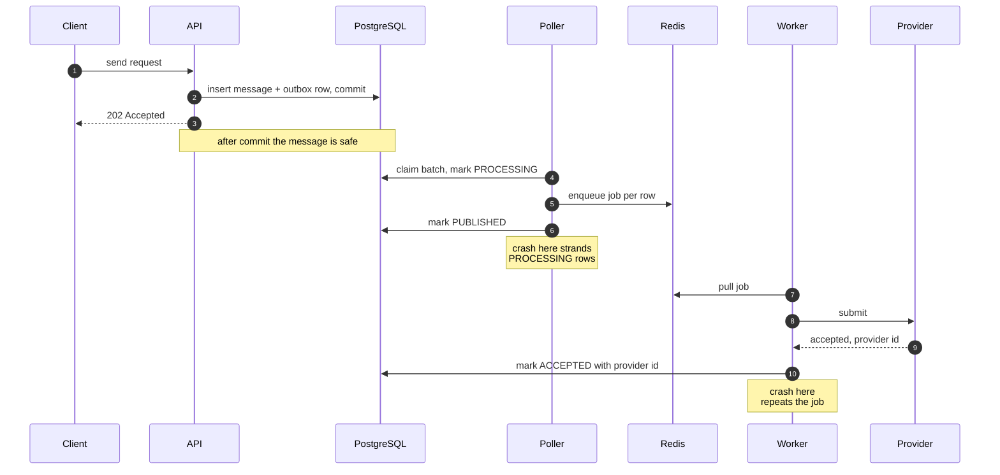
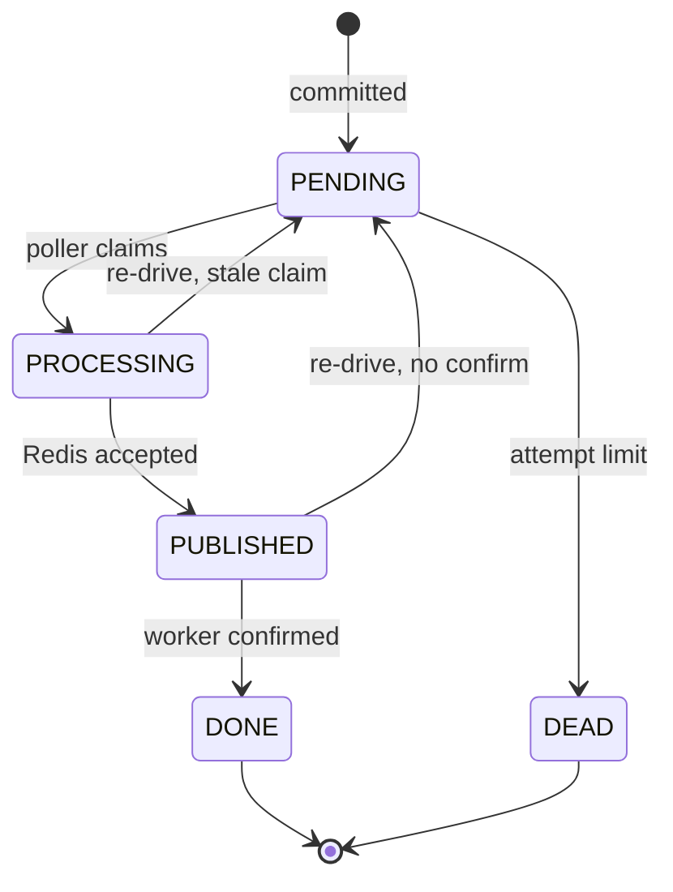

# Build a Message Pipeline That Never Drops a Message

*The outbox pattern on PostgreSQL and Redis, and what it takes to run it at scale.*

A message pipeline has one job that matters more than speed. If a client gets a success response, that message must eventually leave the system. Not usually. Always.

That guarantee is harder than it looks, because it spans two systems that cannot commit together. Your database knows the message exists. Your queue decides when a worker sees it. Nothing makes those two agree by default.

The outbox pattern makes them agree. I built and load tested a pipeline of this shape for several months, and this is the design I would write down for anyone starting the same work. Part 1 defines the guarantee. Part 2 gives the rules that deliver it. Part 3 gives the rules that make it fast. Part 4 covers what breaks when you need much more throughput.

## Part 1: what the guarantee actually is

Write the contract down before you write code. Mine was:

> If the API returns success, the message is delivered to the provider at least once, and the system records what happened to it.

Read that carefully. It says **at least once**, not exactly once. Exactly once does not exist across a network boundary you do not control. You cannot call a provider and crash and know whether the call landed.

So a reliable pipeline has two obligations, not one:

1. **Never lose a message.** Every accepted message reaches the provider, even if any process dies at any moment.
2. **Never let a retry become a second real send.** Because obligation 1 forces retries, obligation 2 is what stops those retries from charging a customer twice.

Most teams build for the first and discover the second in production. Build for both from the start.

Here is the full path of one message, and where it can be lost.



Four moments decide whether the design works. The commit at step 2. The claim at step 4. The gap between the enqueue at step 5 and the mark at step 6. And the gap between the submit at step 8 and the mark at step 10.

Every rule in Part 2 exists to make one of those four moments safe.

## Part 2: the rules that stop message loss

### Rule 1: one transaction, one write

When a request arrives, the direct approach does two writes. Insert the row in PostgreSQL, then push a job to Redis.

That is a dual write, and it has no safe ordering. If the process dies between the two, the row exists and nobody sends it. Swap the order and a worker can pick up a job for a row that was never committed.

Remove the second write. Write both facts to the same database, in the same transaction:

```sql
CREATE TABLE outbox (
  id          bigint GENERATED ALWAYS AS IDENTITY PRIMARY KEY,
  message_id  bigint      NOT NULL REFERENCES messages(id),
  status      text        NOT NULL DEFAULT 'PENDING',
  attempts    integer     NOT NULL DEFAULT 0,
  claimed_at  timestamptz,
  payload     jsonb       NOT NULL,
  created_at  timestamptz NOT NULL DEFAULT now()
);
```

The API inserts the message row and the outbox row, commits, and returns success. Redis is not on the accept path at all. That single change moves your guarantee from "two systems agreed" to "one transaction committed", which is a guarantee PostgreSQL already gives you.

### Rule 2: claim with SKIP LOCKED, and index the claim

A poller reads pending rows and pushes them to Redis. If you want more than one poller, they must not fight over the same rows.

`FOR UPDATE SKIP LOCKED` is what makes that safe. A poller walks past rows another poller already holds, instead of waiting behind them:

```sql
UPDATE outbox
   SET status = 'PROCESSING',
       claimed_at = now(),
       attempts = attempts + 1
 WHERE id IN (
       SELECT id FROM outbox
        WHERE status = 'PENDING'
        ORDER BY id
          FOR UPDATE SKIP LOCKED
        LIMIT $1
 )
RETURNING id, message_id, payload;
```

Give the inner query a partial index, or PostgreSQL scans the whole table to find pending rows. The table fills with finished rows, but the partial index stays small:

```sql
CREATE INDEX outbox_pending_idx ON outbox (id) WHERE status = 'PENDING';
```

Record `claimed_at` and `attempts` now. Rule 3 needs both.

### Rule 3: the outbox row is your only proof, so keep it

This is the rule people get wrong, and I got it wrong too.

My poller claimed a row, pushed the job to Redis, and deleted the outbox row. That looks correct. Redis accepted the job, so the job exists.

Then a container restarted during a load test. Afterwards I found a set of messages stuck in the queued state forever. The outbox table held no rows for them. Redis held no pending, active, or retry job for them. The poller had deleted the proof, the job had not survived the restart, and nothing in the system would ever try again.

Nobody was alerted, because from the outside every counter looked fine.

The outbox row is the only durable record that work is owed. Two rules follow:

**Do not delete on publish. Mark, then confirm.** Move the row to `PUBLISHED` when Redis accepts the job. Move it to `DONE` only when a worker confirms it took ownership. Delete or archive `DONE` rows later, in a separate job.

**Run a re-drive.** Any row that has sat in a non-final state past a timeout goes back to `PENDING`:

```sql
UPDATE outbox
   SET status = CASE WHEN attempts >= $1 THEN 'DEAD' ELSE 'PENDING' END
 WHERE status IN ('PROCESSING', 'PUBLISHED')
   AND claimed_at < now() - $2::interval;
```

The re-drive is not an edge case handler. It is the mechanism that turns "we tried" into "we guarantee". Every state in the diagram below except the final one has a path back to `PENDING`.



Note the `DEAD` state. A row that has failed many times must stop retrying and must become visible. A pipeline that retries forever is not reliable, it is just loud.

### Rule 4: a status you write before a network call is a claim, not proof

In my worker, the handler set the status to `sent_to_provider` as soon as it picked up the task. That happened before the checks ran, and before any call to the provider.

So a message rejected by an internal check produced this history:

```
queued -> picked_from_queue -> sent_to_provider -> failed
```

Nothing ever left the platform. The trail says otherwise.

Use two states, not one. Write `CLAIMED` before the call, and `ACCEPTED` only after the provider answers with an identifier. Then a stalled `CLAIMED` row is a re-drive candidate, and an `ACCEPTED` row is a fact you can bill and report on. If you collapse the two, you can neither retry safely nor answer "did this really send".

### Rule 5: one effect, one idempotency key

At-least-once retries are how you keep obligation 1. A unique key on the effect is how you keep obligation 2.

The effect is the thing that must not repeat: a charge, a provider submit, an outbound webhook. Put a unique constraint on it, keyed on the message:

```sql
CREATE TABLE ledger (
  id              bigint GENERATED ALWAYS AS IDENTITY PRIMARY KEY,
  message_id      bigint NOT NULL,
  idempotency_key text   NOT NULL UNIQUE,
  amount          numeric(12,4) NOT NULL,
  created_at      timestamptz NOT NULL DEFAULT now()
);
```

Two traps, both of which I hit.

**Trap 1: two code paths, two different keys.** In my billing code the send path claimed one key and the recovery path claimed a different key for the same message. The unique index was correct. It could never fire, because the two writers never asked for the same key. A unique index only protects you if every writer of that effect computes the identical key. Test that by writing the effect twice through both paths, not by reading the schema.

**Trap 2: a unique constraint at the wrong scope.** A leftover global unique constraint sat on the provider identifier column. Provider identifiers are short and they wrap, so two different gateways eventually issued the same one. The second write failed, the row was left in exactly the shape a recovery job looks for, and that job sent the message again. The constraint did not prevent a duplicate. It manufactured one.

Scope the constraint to the thing that is genuinely unique, and check what your recovery job does with a failed write.

### Rule 6: unknown input must never be acknowledged silently

Providers send status callbacks. Your parser maps their vocabulary to yours.

Mine mapped one common provider status to an empty string, and the worker then acknowledged the task with no database write at all. No error, no log, no row. The status vanished. A separate bug parsed one timestamp format only, and quietly substituted the current time when parsing failed.

Both were silent, and silent is the worst property a pipeline can have.

Make unknown input loud. An unmapped status goes to a dead letter queue or a parking table with the raw body attached. An unparseable timestamp fails the task instead of inventing a value. You can review a parking table. You cannot review something that never happened.

### Rule 7: accepted is not delivered

The last trap sits outside your code. Some providers answer a delivery receipt request with an intermediate receipt and never send a final one. Their own counters give it away: submitted one, delivered zero.

This looks perfectly healthy. Connections are up, submits succeed, a receipt arrives.

Then a reconciliation job runs, finds messages with no final receipt, and marks a day of real traffic as failed. The pipeline did not lose the messages. The reporting lost them, which the customer experiences as the same thing.

Model the intermediate state explicitly. Never let a reconciliation job convert "outcome unknown" into "failed". Unknown is its own answer, and it needs its own counter.

## Part 3: the rules that make it fast

Everything above is correctness. None of it costs throughput. The rules below are where the throughput actually went, and every one of them is a shape, not a hardware problem.

### Do not let any stage be serial

My send path looped over recipients and awaited one call per recipient. My poller claimed a batch in one statement, then pushed to Redis one row at a time.

A serial loop has a ceiling of one divided by the latency of one step. Halve the latency and you double the ceiling. Nothing else moves it. I added instances, CPU, and a bigger database, and none of it changed a thing.

When I instrumented the poller batch, the serial push to Redis was over 90% of total batch time. The database work was a rounding error. Pushing with bounded concurrency raised the publish rate by 2.8x and took the poller out of the way entirely.

Measure inside your loops, not around them. And when a stage looks slow, find out whether it is slow or only serial. Those need different fixes.

### Never hold a transaction across a network call

One of my services opened a transaction when a batch started and closed it when the batch finished, making hundreds of HTTP calls in between.

I sampled the database mid run. Almost every connection was idle in a transaction, and the oldest had been open for the whole send loop without running any SQL. Active queries were a tiny fraction of capacity. The database was asleep while the system crawled.

A connection pooler cannot fix this, and assuming it could cost me a day. Transaction mode pooling holds a server connection for the life of the transaction. A long transaction pins a slot for exactly that long. The pooler moves the queue. It does not shorten it.

Open the transaction, write, commit, then make the call.

### Size the pools deliberately

A framework default gave one service a pool of a few connections. Under concurrent load the log filled with pool timeouts and roughly half of the load test client's requests died before they were served. The database was not busy. The application refused to talk to it.

Raising the pool gave 23x on the same test. One value in one configuration file.

The point is not "raise your pool". A default is a decision somebody else made for a different workload. Before a load test, sum the pools across every service and every instance, and compare that sum to what your database allows. Do it on paper, before the run.

### Drain, do not tick

My poller ran on a ticker and processed one batch per tick. There was no inner loop, so it never drained the table within a tick. That is a hard ceiling of one batch per interval, and no hardware changes it.

Drain in a loop until the claim returns nothing, with a cap on batches per tick so one tick cannot starve the ticker or block shutdown.

### Isolate job types in separate worker servers

My queue library lets you weight each queue. I read that as a guarantee: sends get most of the capacity, status callbacks get the rest.

That is not what a weight does. I read the library source. One worker server holds one semaphore across all of its queues, and the weight only biases which queue it tries first. There is no floor for any queue. Occupancy settles at the share of pulls multiplied by handler duration, so a queue with plenty of work and slow handlers takes nearly every slot. During a large run, status callbacks held almost all the slots and sends starved.

Strict priority made it worse. It inverted the starvation and stopped callbacks completely.

The fix was to stop sharing the semaphore. I built a second worker server that handles sends only, with its own concurrency limit, and measured it against an identical flood of callbacks. Send throughput rose by 5.5x to 6.6x, and callback throughput did not drop.

If you need isolation between job types, you need separate servers. Weights inside one server are a hint, not a boundary.

### Bound what the queue store keeps, and alarm on it

The pipeline stopped. The API kept returning success. Nothing was being sent.

The queue library enqueued each job with a uniqueness lock, so every job left a lock key alive for several minutes on top of its payload. At sustained rate those keys filled the instance to its memory limit. The eviction policy was `noeviction`, which is correct for a queue, because you never want Redis silently dropping jobs. But once memory is full, `noeviction` means Redis rejects every write. The poller could no longer publish. The API did not depend on Redis to accept a request, so it kept answering with success.

That combination is the dangerous one. A full queue store does not look like an outage. It looks like healthy intake and silent delivery.

Count the keys each message creates, not just its payload. Alarm on the memory limit as a percentage. And make sure your API health check reflects whether the pipeline behind it can still accept work.

### Expect the bottleneck to move

Late in the work I cached a slow lookup that had been the worst hop in the send path. The hop went to effectively zero. Throughput went down.

Two constraints had been hiding behind that hop: a downstream service that had never been scaled and had a tiny pool of its own, and the serial push that had never been configured. Both only became visible once the slow hop stopped covering for them.

Removing a bottleneck pays nothing until you find the next one. Read the whole timing breakdown after every change. The number that grew is your new wall. Three of my six tuning runs bought nothing, because I had not found the real constraint first.

## Part 4: above the ceiling

Part 3 raises a pipeline of this shape by a large factor and then stops. To go materially higher, the shape has to change. Three things break next.

**One poller is one writer.** A single poller is a serial claim loop, and batching does not remove that. There are two ways out. Partition the outbox on a hash key and give each poller a disjoint set of partitions, so pollers never contend for the same rows. Or stop polling. Read the write ahead log with change data capture, and let the database tell you what changed instead of asking it on a timer. Change data capture is more moving parts, and it removes the ceiling rather than raising it.

**One queue store becomes the shared wall.** The isolation rule applies one level up as well. One Redis instance is one memory limit, one connection limit, and one failure. At high rate, give each job type its own worker fleet and its own store. Otherwise the loudest job type takes the capacity, and one memory limit stops everything at once.

**Stop updating the same row repeatedly.** This is the one people miss. A message that moves through several states rewrites its row each time. PostgreSQL cannot do that cheaply if any indexed column changes, because then it writes a new row version and a new entry in every index on the table. A status column is exactly the column people index. So the write cost of a message is not one insert. It is one insert plus a full rewrite of the row and its index set, once per state change.

Stop mutating. Append each state change to an event log, treat current state as a derived value, and run a compaction job that folds old events away. Writes become appends, appends batch well, and the index churn disappears. You also get a real history, which you will want the first time a customer disputes a delivery.

## The short version

The outbox pattern gives you one thing: the message and the intent to send it commit together. That is the foundation, and it is not the building.

The rest of the guarantee comes from rules that sit around it. Keep the outbox row until someone else owns the message. Re-drive anything that goes stale. Separate a claim from a confirmation. Put a unique key on the effect, and prove every writer computes the same key. Make unknown input loud instead of silent. Never turn "unknown" into "failed".

Then, and only then, make it fast. No serial stages, no transactions held across network calls, deliberate pool sizes, drains instead of ticks, and separate worker servers for job types that must not starve each other.

Build the outbox, then stop trusting the diagram. Load test what you actually deployed, instrument inside the loops, and after every fix go and look for the wall that just became visible.
